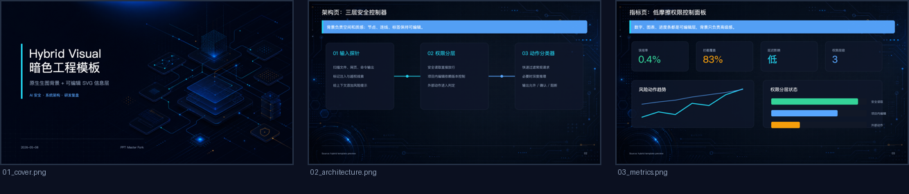

# Dark AI Engineering Hybrid Preview

This sample validates the `dark_ai_engineering_hybrid` template: raster-generated backgrounds provide the visual atmosphere, while titles, captions, cards, metrics, lines, and charts remain editable SVG / DrawingML information layers.

## Output

- Native editable PPTX: `exports/template_preview_dark_ai_engineering_hybrid_20260508_122450.pptx`
- SVG reference PPTX: `exports/template_preview_dark_ai_engineering_hybrid_20260508_122450_svg.pptx`

## Slides

| Slide | Purpose |
|-------|---------|
| `01_cover.svg` | Opening page with generated spatial background and editable title block |
| `02_architecture.svg` | Architecture chain page with editable process cards |
| `03_metrics.svg` | Dashboard page with editable metric cards, chart line, and status bars |

## Reuse Notes

- Use this template when visual polish matters more than full-background editability.
- Keep important text and data outside the raster background so it remains editable.
- Replace the background images only when changing the visual direction; preserve the information-layer grid and contrast rules.
