# Style Sample Library

这个目录保存可复用的 16:9 PNG 风格样片，用于 PPT Master 模板设计和风格对齐。

样片不是 layout 模板本身，也不是最终 PPT 页面。使用时应把视觉语言重建为可编辑 SVG / DrawingML 元素，不要把样片整张贴进最终页面。

## 使用原则

1. 只把图片作为风格参考。
2. 不复制样片里的不可编辑文字或截图式元素。
3. 最终页面需要重建为可编辑形状、文本、图表和本地图片。
4. 遵守 `references/shared-standards.md` 与 `SKILL.md` 的 SVG/PPTX 约束。
5. 未经用户提供授权材料，不使用真实 logo、印章、水印或可读仿冒品牌文字。

## 样片索引

| 样片 | 预览 | 适合场景 | 视觉方向 |
|------|------|----------|----------|
| `风格_高端咨询` | 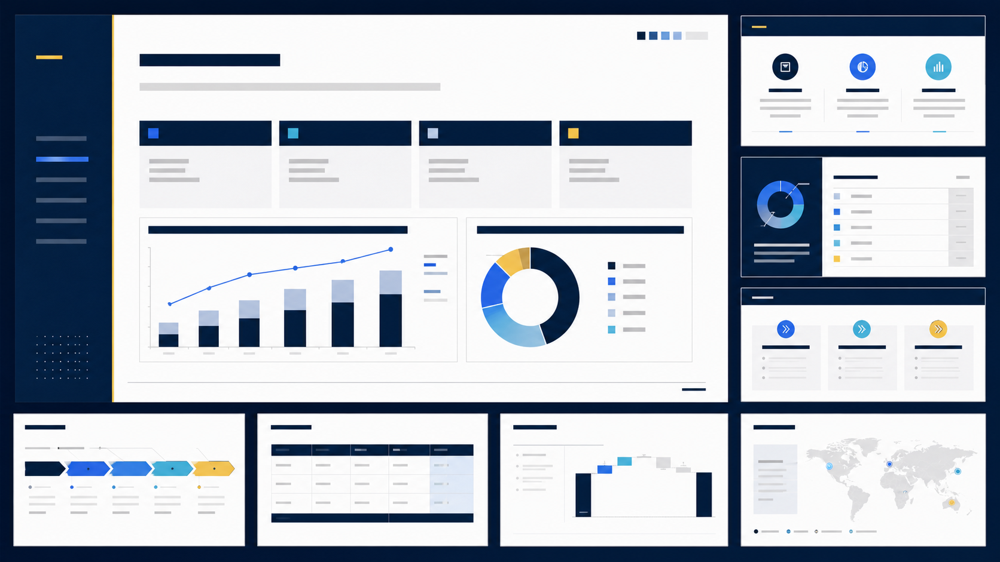 | 战略咨询、董事会汇报、投资分析、高管汇报 | 深海军蓝与白底网格，搭配克制青色和金色强调，强调咨询式层级。 |
| `风格_现代政企红` | 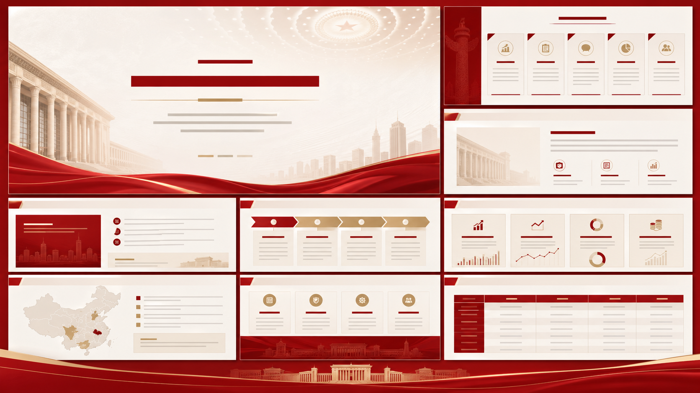 | 政府报告、国企汇报、政策沟通、正式汇报 | 深红、象牙白和哑金色，结构对称，具有正式公文节奏。 |
| `风格_暗色AI工程` | 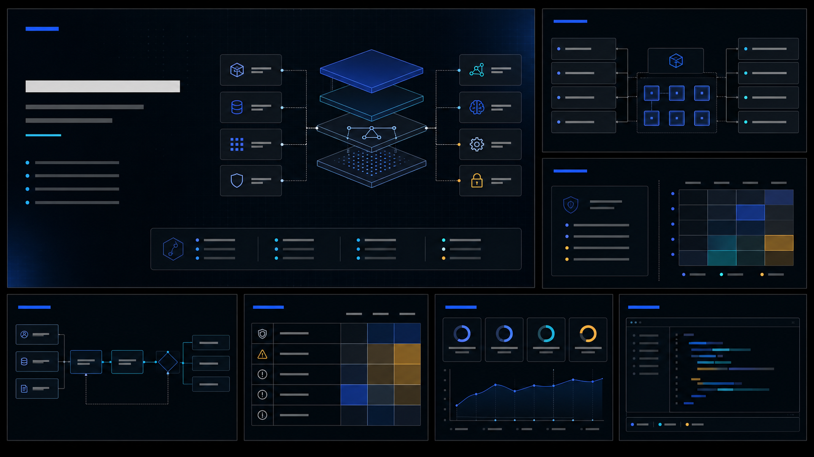 | AI 安全、工程架构、系统评审、开发者分享 | 近黑技术界面、板岩色面板、蓝青色架构模块和风险强调色。 |
| `风格_学术研究` | 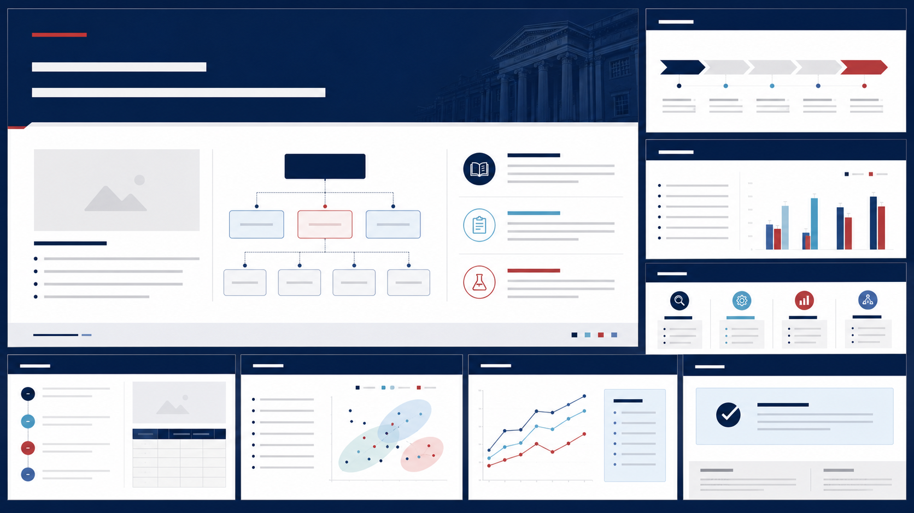 | 学位答辩、学术汇报、科研申请、课题报告 | 高校蓝研究网格，方法论模块、发现面板和学术留白。 |
| `风格_医学高校` | 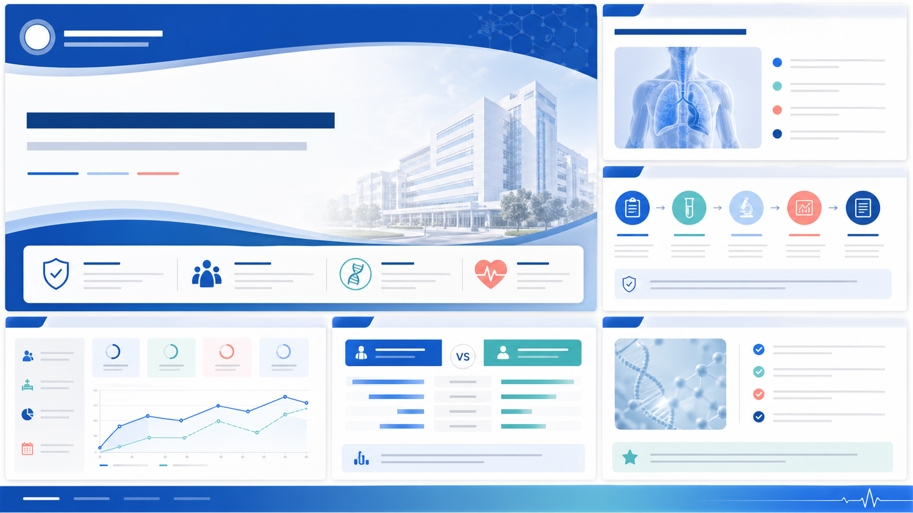 | 医院汇报、病例讨论、临床研究、医学讲座 | 医学蓝与白色临床画布，协议流程、病例概览和指标模块。 |
| `风格_高端金融` | 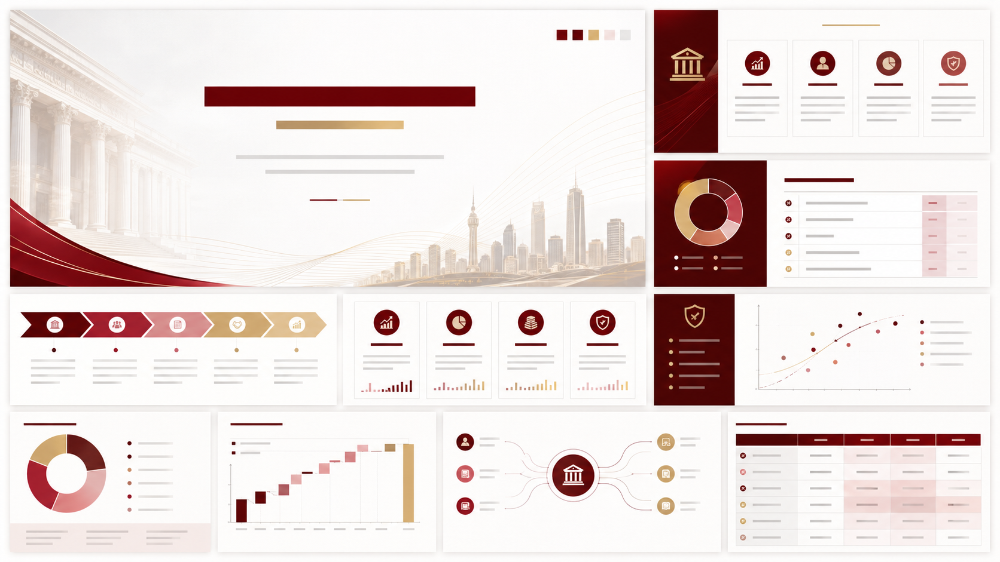 | 银行、财富管理、交易银行、金融高管汇报 | 银行红、珍珠白、石墨灰和暖金点缀，强调高端留白。 |
| `风格_科技年度报告` | 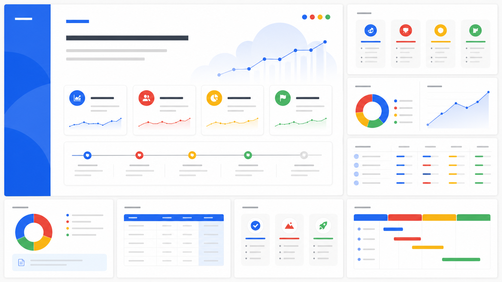 | 年度报告、团队复盘、产品分析、OKR 总结 | 明亮白底、四色点缀、模块化仪表盘卡片和友好的数据叙事。 |
| `风格_心理咨询` | 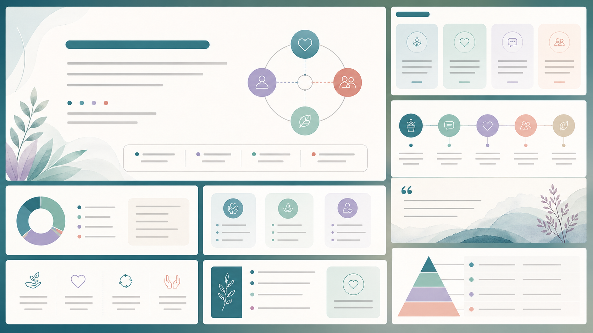 | 心理课程、咨询培训、依恋理论、临床教育 | 温暖蓝绿色治疗感，软面板、关系图和反思卡片。 |
| `风格_像素技术培训` | 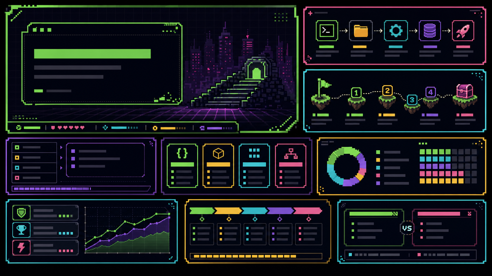 | 开发者入门、Git 培训、游戏化技术教育、复古技术课 | 暗色像素网格、霓虹绿/品红/青色和关卡式学习节奏。 |
| `风格_禅意经典` | 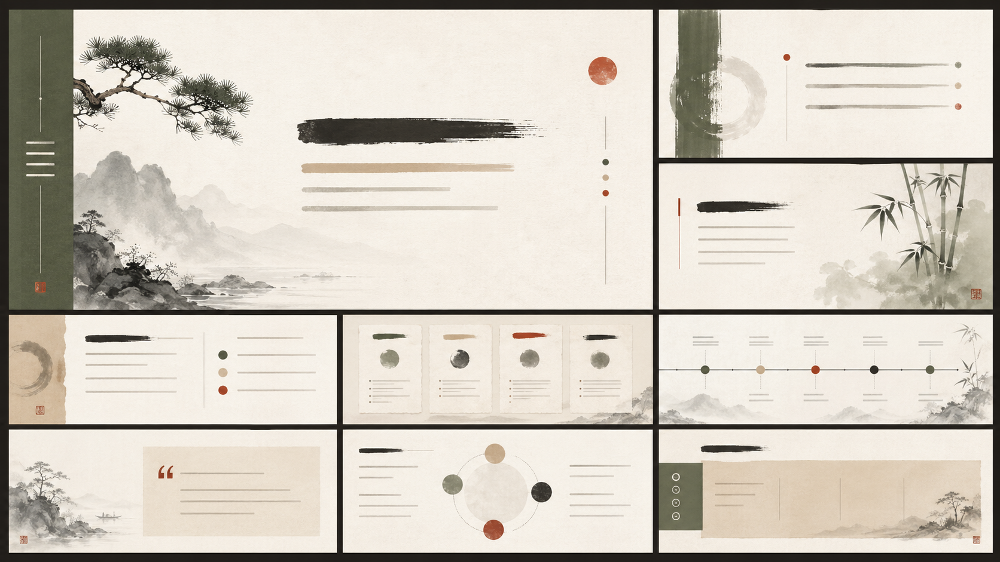 | 经典研读、哲学讲座、传统文化、人文课程 | 水墨克制、暖纸质感、苔绿色与朱砂点缀，大留白。 |
| `风格_能源基建` | 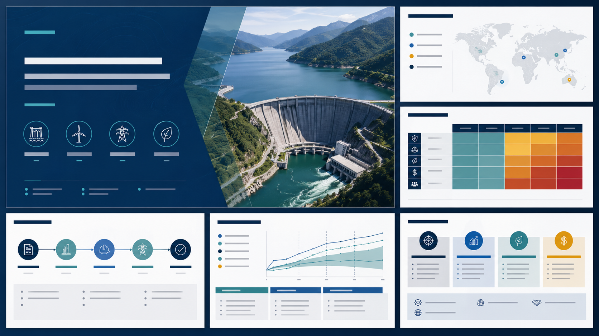 | 基建战略、能源项目、国际工程、投资评审 | 深海蓝咨询版式，项目地图、风险矩阵和财务敏感性模块。 |
| `风格_汽车认证` | 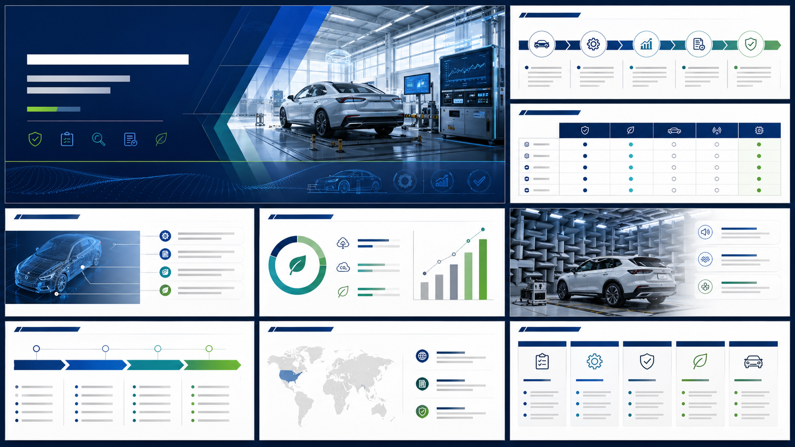 | 汽车测试、认证机构、绿色出行战略、技术路线图 | 深蓝技术报告，青色和绿色强调，测试管线、认证矩阵和路线图。 |


## 提示词模式

扩展样片库时可使用：

```text
Use case: productivity-visual
Asset type: reusable PPT template reference sample, 16:9 widescreen theme board
Primary request: Create a polished reference sample image for a <domain/style> presentation theme. It should be a reusable visual direction for PPT Master templates, not a finished slide with readable copy.
Scene/backdrop: <domain atmosphere>
Subject: abstract PowerPoint-style layout preview with <relevant page modules>
Composition: 16:9, <layout rhythm>
Style: <style language>
Color palette: <core colors>
Text: no readable text, only abstract placeholder lines and blocks.
Avoid: logos, brand names, readable text, watermarks, people unless explicitly required.
```

## 文件命名

图片文件继续使用英文 snake_case，便于脚本和跨平台路径处理：

```text
<style_slug>_sample.png
```

索引 ID 和展示名称使用中文优先，方便查询和复用。
